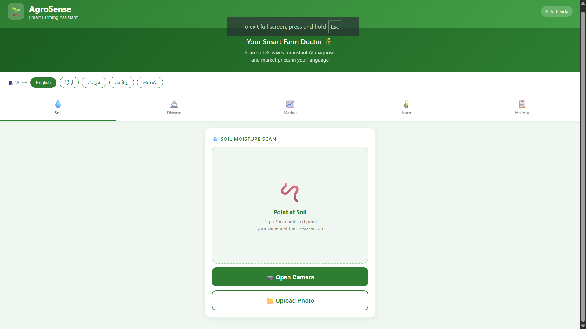
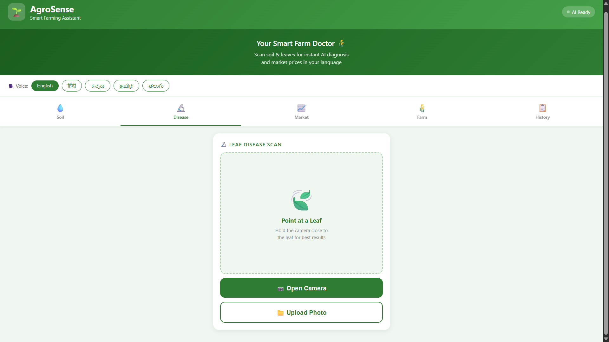
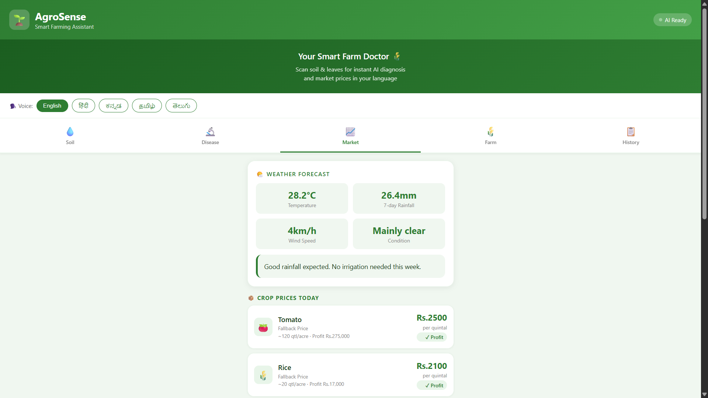
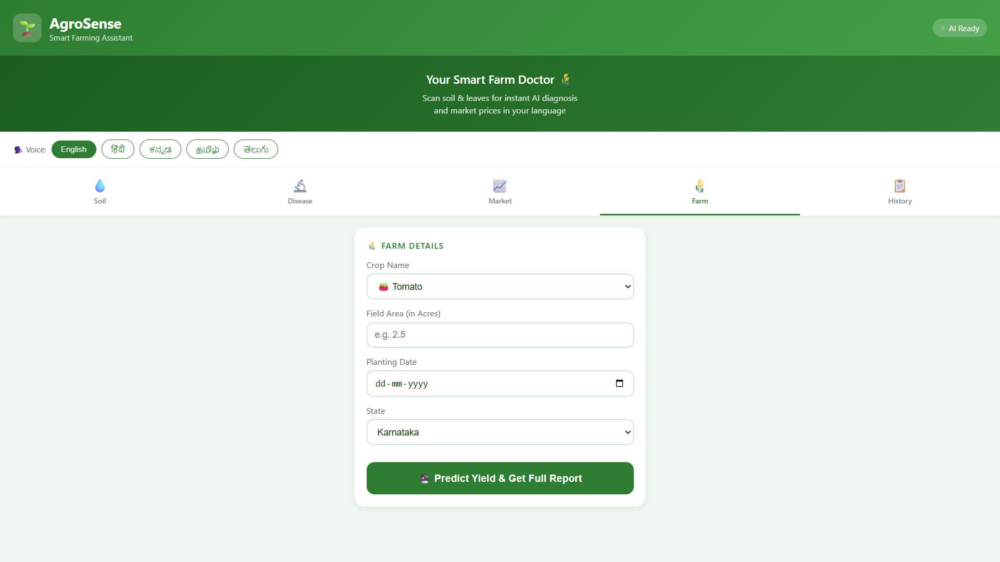

# 🌱 AgroSense — AI-Powered Smart Farming Assistant

<div align="center">


**An intelligent farming companion that helps Indian farmers make smarter decisions using AI, real-time data, and machine learning.**

🌐 **Live Demo:** [https://akash91647-agrosense.hf.space](https://akash91647-agrosense.hf.space)
🐙 **GitHub:** [https://github.com/Akash-2201/Agrosense](https://github.com/Akash-2201/Agrosense)

</div>

---

## 📸 Screenshots

| Home / Soil Analysis | Disease Detection |
|:---:|:---:|
|  |  |

| Market Analytics | Farm Dashboard |
|:---:|:---:|
|  |  |

---

## 📖 Table of Contents

- [About the Project](#about-the-project)
- [Features](#features)
- [Tech Stack](#tech-stack)
- [Project Structure](#project-structure)
- [ML Models](#ml-models)
- [Datasets](#datasets)
- [API Endpoints](#api-endpoints)
- [Installation & Setup](#installation--setup)
- [Deployment](#deployment)

---

## 🧠 About the Project

AgroSense is a full-stack AI-powered web application designed to assist Indian farmers with soil analysis, crop disease detection, market price monitoring, weather forecasting, and yield prediction — all in one platform.

Built as a college project, AgroSense combines deep learning models trained on real agricultural datasets, real-time government APIs, R-based statistical analytics, and multilingual text-to-speech to create an accessible farming tool for rural India.

---

## ✨ Features

### 🪨 Soil Analysis
- Upload a photo of your soil and get instant classification
- Detects 4 soil types: **Alluvial, Black, Clay, and Red soil**
- Provides moisture percentage and irrigation recommendations
- Combines ML prediction with smart weather-based irrigation decisions

### 🌿 Plant Disease Detection
- Upload a leaf image to detect crop diseases
- Classifies **38 different plant diseases** across multiple crops
- Powered by EfficientNet deep learning model
- Recommends products and treatments for detected diseases

### 📈 Market Intelligence
- Live crop prices fetched from **Agmarknet (data.gov.in)**
- Price trend charts for Tomato, Rice, Wheat, Onion, Potato
- Statistical analysis using **R (ggplot2)** — price trends, volatility, profit comparison
- Best selling month advice per crop
- Crop suggestion engine based on soil type and expected profit per acre

### 🌦️ Weather Forecast
- 7-day weather forecast using **Open-Meteo API**
- Smart irrigation advice combining soil moisture and weather data
- Rain prediction to help farmers plan watering schedules

### 🌾 Yield Prediction
- Predicts crop yield based on crop type, area, planting date, and state
- Calculates water requirements based on soil moisture levels
- Revenue and profit estimates per acre

### 📄 Report Generation
- Download professional PDF reports for soil analysis and disease detection
- Farm reports with charts, recommendations, and treatment plans

### 🔊 Multilingual Text-to-Speech
- Voice output in 5 Indian languages: **English, Hindi, Kannada, Tamil, Telugu**
- Powered by gTTS and Google Translate API
- Makes the app accessible to farmers who prefer audio over text

### 📱 Progressive Web App (PWA)
- Installable on mobile devices like a native app
- Offline support via service worker
- Mobile-friendly responsive design

---

## 🛠️ Tech Stack

| Layer | Technology |
|-------|-----------|
| Backend | Python 3.11, Flask 3.1, Gunicorn |
| ML / Deep Learning | TensorFlow 2.21, Keras 3.14, EfficientNet |
| Statistical Analytics | R 4.x, ggplot2, dplyr, readr |
| Database | SQLite (soil reading history) |
| Caching | Redis (with direct API fallback) |
| Weather API | Open-Meteo (free, no key needed) |
| Market API | Agmarknet via data.gov.in |
| TTS | gTTS + deep-translator |
| Report Generation | ReportLab (PDF) |
| Containerization | Docker |
| Hosting | Hugging Face Spaces |

---

## 📁 Project Structure

```
agrosense/
├── app.py                        # Main Flask application & all API routes
├── Dockerfile                    # Docker container configuration
├── requirements.txt              # Python dependencies
│
├── models/                       # All ML models and services
│   ├── soil_analyzer.py          # Soil classification model
│   ├── disease_detector.py       # Plant disease detection model
│   ├── market.py                 # Live market price service
│   ├── market_analyzer.py        # Market analytics & crop suggestions
│   ├── weather.py                # Weather forecast service
│   ├── yield_predictor.py        # Crop yield prediction
│   ├── product_recommender.py    # Disease treatment recommendations
│   ├── report_generator.py       # PDF report generation
│   ├── cache.py                  # Redis caching service
│   ├── soil_model/               # ⚠️ Not included - download below
│   │   └── soil_classifier_v3.keras
│   └── disease_model/            # ⚠️ Not included - download below
│       └── disease_classifier.keras
│
├── analytics/
│   └── market_analytics.R        # R script for market charts (ggplot2)
│
├── database/
│   └── db.py                     # SQLite database setup & queries
│
├── static/                       # Frontend (PWA web app)
│   ├── index.html                # Main HTML entry point
│   ├── sw.js                     # Service Worker (offline support)
│   ├── manifest.json             # PWA manifest
│   ├── charts/                   # Generated R chart images
│   └── tts/                      # Generated TTS audio files
│
├── screenshots/                  # App screenshots
├── plant_training.ipynb          # Disease model training notebook
└── requirements.txt              # Python dependencies
```

---

## 🤖 ML Models

> ⚠️ Model files are **not included** in this repository due to their large size.
> Download them from the links below and place them in the correct folders before running.

### 📥 Download Models

| Model | File | Size | Download Link | Place In |
|-------|------|------|---------------|----------|
| Soil Classifier | `soil_classifier_v3.keras` | ~78 MB | [⬇️ Download from HuggingFace](https://huggingface.co/spaces/Akash91647/AgroSense/resolve/main/models/soil_model/soil_classifier_v3.keras) | `models/soil_model/` |
| Disease Classifier | `disease_classifier.keras` | ~123 MB | [⬇️ Download from HuggingFace](https://huggingface.co/spaces/Akash91647/AgroSense/resolve/main/models/disease_model/disease_classifier.keras) | `models/disease_model/` |

After downloading, your folder structure should look like:
```
models/
├── soil_model/
│   └── soil_classifier_v3.keras     ← place here
└── disease_model/
    └── disease_classifier.keras     ← place here
```

### Model Details

**Soil Classifier**
- Architecture: EfficientNetB0 (transfer learning)
- Classes: Alluvial Soil, Black Soil, Clay Soil, Red Soil
- Input: 224×224 RGB image

**Disease Detector**
- Architecture: EfficientNet (fine-tuned)
- Classes: 38 plant diseases across multiple crops
- Input: 224×224 RGB leaf image
- Training Notebook: `plant_training.ipynb`

---

## 📊 Datasets

> These are the datasets used to train the models and power the app.

| Dataset | Description | Size | Source |
|---------|-------------|------|--------|
| Soil Image Dataset | Indian soil types — Alluvial, Black, Clay, Red | ~150 MB | [🔗 Kaggle - Soil Classification](https://www.kaggle.com/datasets/rastogi2000/soil-classification) |
| PlantVillage Disease Dataset | 38 plant disease classes, 50,000+ leaf images | ~1 GB | [🔗 Kaggle - PlantVillage Dataset](https://www.kaggle.com/datasets/abdallahalidev/plantvillage-dataset) |
| Agmarknet Crop Prices | Live Indian market prices by state and commodity | Live API | [🔗 data.gov.in Agmarknet API](https://data.gov.in/resource/9ef84268-d588-465a-a308-a864a43d0070) |
| Weather Data | 7-day forecast by latitude/longitude | Live API | [🔗 Open-Meteo API](https://open-meteo.com/) |

---

## 📡 API Endpoints

| Method | Endpoint | Description |
|--------|----------|-------------|
| GET | `/api/health` | Health check |
| POST | `/api/analyze/soil` | Soil image analysis |
| POST | `/api/analyze/disease` | Disease detection |
| GET | `/api/weather` | Weather forecast |
| POST | `/api/market/multiple` | Multiple crop prices |
| GET | `/api/market/<crop>` | Single crop price |
| GET | `/api/market/analytics/generate` | Generate R charts |
| GET | `/api/market/best-sell/<crop>` | Best sell advice |
| GET | `/api/market/suggest/<soil>/<area>` | Crop suggestion |
| POST | `/api/yield` | Yield prediction |
| POST | `/api/smart-recommendation` | Smart irrigation advice |
| POST | `/api/water` | Water requirement |
| POST | `/api/report/soil` | Generate soil PDF report |
| POST | `/api/report/disease` | Generate disease PDF report |
| POST | `/api/tts` | Text-to-speech (5 languages) |
| GET | `/api/history/soil/<farm_id>` | Soil analysis history |

---

## ⚙️ Installation & Setup

### Prerequisites
- Python 3.11+
- R 4.x with ggplot2, dplyr, readr packages
- Git

### 1. Clone the repository
```bash
git clone https://github.com/Akash-2201/Agrosense.git
cd Agrosense
```

### 2. Create virtual environment
```bash
python -m venv venv
# Windows
venv\Scripts\activate
# Mac/Linux
source venv/bin/activate
```

### 3. Install Python dependencies
```bash
pip install -r requirements.txt
```

### 4. Install R packages
```r
install.packages(c("ggplot2", "dplyr", "readr"))
```

### 5. Download ML Models
Download the model files from the [ML Models](#ml-models) section above and place them here:
```
models/soil_model/soil_classifier_v3.keras
models/disease_model/disease_classifier.keras
```

### 6. Set up environment variables
Create a `.env` file in the root directory:
```env
MARKET_API_KEY=your_data_gov_in_api_key
```
Get a free API key from [data.gov.in](https://data.gov.in/user/register)

### 7. Run the app
```bash
python app.py
```

Visit `http://localhost:7860` 🚀

---

## 🚀 Deployment

### Hugging Face Spaces (Current Live Demo)
The app is deployed on Hugging Face Spaces using Docker.
Live at: [https://akash91647-agrosense.hf.space](https://akash91647-agrosense.hf.space)

> **Note:** On Hugging Face, external API calls to data.gov.in are blocked so market prices use realistic fallback data. For fully live data deploy on Railway.

### Docker (Local)
```bash
docker build -t agrosense .
docker run -p 7860:7860 agrosense
```

### Railway (Recommended for Live Data)
1. Connect your GitHub repo to [Railway](https://railway.app)
2. Add environment variables in Railway dashboard
3. Railway auto-deploys on every push — real live market data works here ✅

---

## 👨‍💻 Author

**Akash** — [GitHub](https://github.com/Akash-2201) | [Hugging Face](https://huggingface.co/Akash91647)

---

## 📄 License

This project is built for educational purposes as a college project.

---

<div align="center">
Made with ❤️ for Indian Farmers 🌾
</div>
